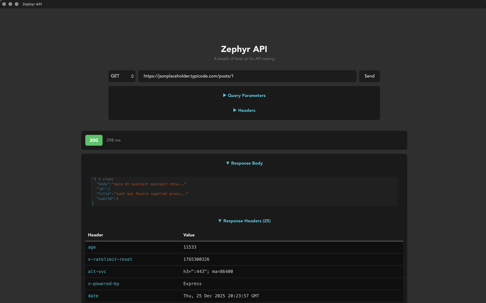

# Zephyr API

> A breath of fresh air for API testing

A powerful, cross-platform desktop application for testing and exploring REST APIs, built with Tauri, React, and TypeScript. Think Postman/Insomnia, but as a lightweight native desktop app.



## ✨ Features

### 🚀 HTTP Methods
- **GET** - Retrieve data from APIs
- **POST** - Create new resources
- **PUT** - Update existing resources
- **DELETE** - Remove resources

### 🔧 Request Building
- **Query Parameters Builder** - Add URL parameters with key-value pairs
- **Custom Headers** - Set any HTTP headers (Authorization, Content-Type, etc.)
- **Request Body Builder** - Build JSON request bodies with a simple key-value form
- **Auto JSON Parsing** - Values are automatically parsed as JSON when possible

### 📊 Response Inspection
- **JSON Syntax Highlighting** - Beautiful, color-coded JSON display
- **Collapsible Tree View** - Expand/collapse nested objects and arrays
- **Response Headers** - View all HTTP headers returned by the server
- **Status Codes** - Color-coded badges (2xx green, 3xx blue, 4xx orange, 5xx red)
- **Request Timing** - See how long each request takes in milliseconds
- **Request Details** - Review exactly what was sent (method, URL, headers, body)

### 🎨 UI/UX
- **Dark Mode** - Automatic system preference detection
- **Collapsible Sections** - Keep your workspace clean and organized
- **Monospace Fonts** - Easy-to-read technical details
- **Responsive Design** - Works on various screen sizes

### 🔒 Benefits of Tauri Backend
- **CORS-Free** - Bypass browser CORS restrictions by making requests from Rust
- **Native Performance** - Fast HTTP requests with Rust's `reqwest` crate
- **Cross-Platform** - Works on macOS, Windows, and Linux
- **Small Bundle Size** - Lighter than Electron alternatives

## 🛠️ Technology Stack

**Frontend:**
- React 18 - UI framework
- TypeScript - Type safety
- Vite - Fast build tool and dev server
- @uiw/react-json-view - JSON visualization

**Backend:**
- Tauri v2 - Desktop app framework
- Rust - Systems programming language
- reqwest - HTTP client library
- serde/serde_json - JSON serialization
- tokio - Async runtime

## 📦 Installation

### Prerequisites
- [Node.js](https://nodejs.org/) (v18 or later)
- [Rust](https://rustup.rs/) (latest stable)
- Platform-specific dependencies:
  - **macOS**: Xcode Command Line Tools
  - **Linux**: See [Tauri prerequisites](https://tauri.app/v1/guides/getting-started/prerequisites#setting-up-linux)
  - **Windows**: Microsoft Visual Studio C++ Build Tools

### Setup

1. **Clone the repository**
   ```bash
   git clone <repository-url>
   cd zephyr-api
   ```

2. **Install dependencies**
   ```bash
   npm install
   ```

3. **Run in development mode**
   ```bash
   npm run tauri dev
   ```

4. **Build for production**
   ```bash
   npm run tauri build
   ```
   The compiled app will be in `src-tauri/target/release/bundle/`

## 🎯 Usage Examples

### Example 1: Simple GET Request
1. Select **GET** method
2. Enter URL: `https://api.github.com/users/github`
3. Click **Send**
4. View response body, headers, and status code

### Example 2: GET with Query Parameters
1. Select **GET** method
2. Enter URL: `https://api.github.com/search/repositories`
3. Open **Query Parameters** section:
   - Add: `q` = `tauri`
   - Add: `sort` = `stars`
   - Add: `order` = `desc`
4. Click **Send**
5. Check **Request Details** to see the full URL with query string

### Example 3: POST with JSON Body
1. Select **POST** method
2. Enter URL: `https://jsonplaceholder.typicode.com/posts`
3. Open **Request Body** section:
   - Add: `title` = `My Test Post`
   - Add: `body` = `This is a test`
   - Add: `userId` = `1`
4. Click **Send**
5. Response shows the created resource with an ID

### Example 4: Custom Headers
1. Select **GET** method
2. Enter URL: `https://api.github.com/user`
3. Open **Headers** section:
   - Add: `Accept` = `application/vnd.github.v3+json`
   - Add: `Authorization` = `token YOUR_TOKEN`
4. Click **Send**

### Example 5: Testing with httpbin
Try these URLs to test various features:
- **Echo headers**: `https://httpbin.org/headers`
- **Echo POST data**: `https://httpbin.org/post`
- **Delayed response**: `https://httpbin.org/delay/2`
- **Status codes**: `https://httpbin.org/status/404`

## 🧑‍💻 Development

### Project Structure
```
zephyr-api/
├── src/                  # React frontend
│   ├── App.tsx          # Main application component
│   ├── App.css          # Styles
│   └── main.tsx         # React entry point
├── src-tauri/           # Rust backend
│   ├── src/
│   │   ├── lib.rs       # Tauri commands and logic
│   │   └── main.rs      # Entry point
│   ├── Cargo.toml       # Rust dependencies
│   └── tauri.conf.json  # Tauri configuration
├── package.json         # Node dependencies
└── vite.config.ts       # Vite configuration
```

### Available Commands

**Frontend:**
```bash
npm run dev          # Run Vite dev server only
npm run build        # Build frontend only
npm run preview      # Preview production build
```

**Tauri:**
```bash
npm run tauri dev    # Run full app in dev mode (frontend + backend)
npm run tauri build  # Build production app bundle
```

**Rust Backend:**
```bash
cd src-tauri
cargo build          # Compile Rust code
cargo check          # Fast compile check
cargo test           # Run tests
cargo clippy         # Lint Rust code
```

### Adding New Tauri Commands

1. Define command in `src-tauri/src/lib.rs`:
   ```rust
   #[tauri::command]
   async fn my_command(param: String) -> Result<String, String> {
       Ok(format!("Received: {}", param))
   }
   ```

2. Register in the handler:
   ```rust
   .invoke_handler(tauri::generate_handler![greet, fetch_json, my_command])
   ```

3. Call from React:
   ```typescript
   import { invoke } from "@tauri-apps/api/core";

   const result = await invoke<string>("my_command", { param: "test" });
   ```

## 🎨 Customization

### Changing Window Size
Edit `src-tauri/tauri.conf.json`:
```json
{
  "app": {
    "windows": [{
      "width": 1400,
      "height": 900
    }]
  }
}
```

### Modifying Collapsed Depth
In `App.tsx`, adjust the `collapsed` prop:
```typescript
<JsonView
  value={response.body}
  collapsed={3}  // Change depth level
  // ...
/>
```

### Adding More HTTP Methods
1. Update method validation in `src-tauri/src/lib.rs`:
   ```rust
   if !["GET", "POST", "PUT", "DELETE", "PATCH"].contains(&method.as_str()) {
   ```

2. Add to request builder:
   ```rust
   "PATCH" => client.patch(&full_url),
   ```

3. Add to frontend dropdown in `App.tsx`:
   ```tsx
   <option value="PATCH">PATCH</option>
   ```

## 🐛 Troubleshooting

### CORS Errors
This app should **not** have CORS issues because requests are made from Rust backend, not the browser. If you see CORS errors, ensure you're using the Tauri command, not browser `fetch()`.

### Build Failures
- **Rust errors**: Make sure Rust is up to date: `rustup update`
- **Node errors**: Delete `node_modules` and `package-lock.json`, then run `npm install`
- **Platform-specific**: Check [Tauri's troubleshooting guide](https://tauri.app/v1/guides/debugging/)

### Performance Issues
- Large JSON responses (>1MB) may render slowly
- Increase `max-height` in `.json-viewer-container` CSS if needed
- Consider adding pagination for large arrays

## 📝 License

This project is open source and available under the [MIT License](LICENSE).

## 🤝 Contributing

Contributions are welcome! Areas for improvement:
- [ ] Request history/collections
- [ ] Save/load requests
- [ ] Export responses to file
- [ ] Request/response tabs for multiple concurrent requests
- [ ] GraphQL support
- [ ] WebSocket testing
- [ ] Authentication presets (OAuth, JWT, etc.)
- [ ] Environment variables
- [ ] Code generation (curl, JavaScript, Python, etc.)

## 🔗 Resources

- [Tauri Documentation](https://tauri.app/)
- [React Documentation](https://react.dev/)
- [Rust Book](https://doc.rust-lang.org/book/)
- [reqwest Documentation](https://docs.rs/reqwest/)

## 🙏 Acknowledgments

Built with:
- [Tauri](https://tauri.app/) - Desktop app framework
- [@uiw/react-json-view](https://github.com/uiwjs/react-json-view) - JSON viewer component
- [JSONPlaceholder](https://jsonplaceholder.typicode.com/) - Free fake API for testing

---

**Note**: This is a learning project demonstrating Tauri's capabilities for building desktop applications with web technologies. For production use, consider adding features like request validation, error boundaries, and comprehensive testing.
